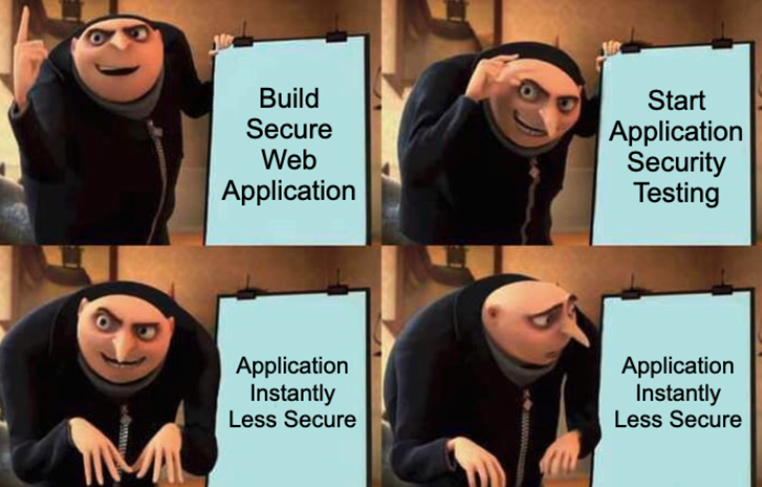

# Application Security Notes 

- Links to supplementary resources or credits are added wherever required.
- Feel free to raise a PR for any corrections.

## Topics:
- This is an ever-growing checklist that expands with my never-ending learning. 🤓

### Web Application Security
- [x] OWASP Top 10
- [x] XSS, CSP
- [x] CSRF, CORS, SOP
- [x] Open redirect
- [x] SSRF
- [x] SQLi
- [x] XPATHi
- [x] XXE
- [x] LFI, RFI
- [x] SSTI
- [x] JWT
- [x] Broken Access Control, IDOR
- [x] Clickjacking
- [x] Business Logic Flaws
- [ ] Prototype Pollution
- [ ] HTTP Request Smuggling
- [ ] OAuth 2.0
- [ ] Web Socket Vulnerabilities
- [ ] Web Cache Poisoning
- [ ] HTTP Host header Attacks

### Mobile Security
- [ ] OWASP Top 10
- [x] Android
- [ ] iOS 

### API Security
- [x] OWASP Top 10
- [x] REST API
- [ ] GraphQL

### Thick Client Security
- [x] Cries in noob 😭
