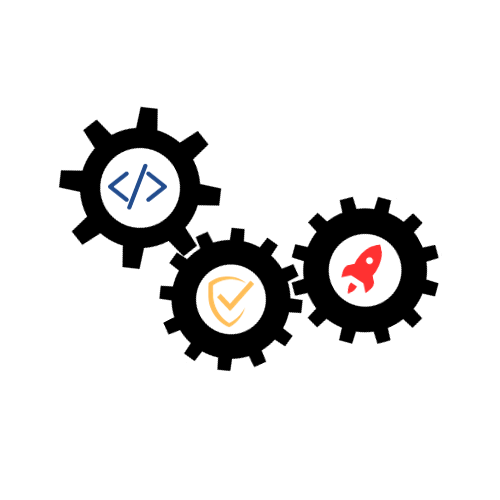

# Application Security Notes 

## Topics:

- This is an ever-growing checklist that expands with my never-ending learning. 🤓
- Links to supplementary resources or credits are added within the notes.
- I'm no expert, so feel free to raise a PR with any corrections.

### Web Application Security
- [x] OWASP Top 10
- [x] XSS, CSP
- [x] CSRF, CORS, SOP
- [x] Open redirect
- [x] SSRF
- [x] SQLi
- [ ] NoSQLi
- [x] XPATHi
- [x] XXE
- [x] LFI, RFI
- [x] SSTI
- [x] JWT
- [x] Broken Access Control, IDOR
- [x] Clickjacking
- [x] Business Logic Flaws
- [ ] Race Conditions
- [ ] HTTP Host header Attacks
- [ ] OAuth 2.0
- [ ] SAML
- [ ] Web Socket Vulnerabilities
- [ ] Insecure deserialization
- [ ] Prototype Pollution
- [ ] HTTP Request Smuggling
- [ ] Web Cache Poisoning
- [ ] DOM vulnerabilities

### Mobile Security
- [x] OWASP Top 10
- [x] Android
- [x] iOS 

### API Security
- [x] OWASP Top 10
- [x] REST API
- [x] GraphQL

### Thick Client Security
- [ ] Thick/Heavy/Rich/Fat client 

### DevSecOps Concepts
- [x] Concepts - ShiftLeft, Agile, CI/CD, SAST/SCA
- [x] Docker Security
- [ ] Kubernetes Security
- [ ] Threat Modeling
